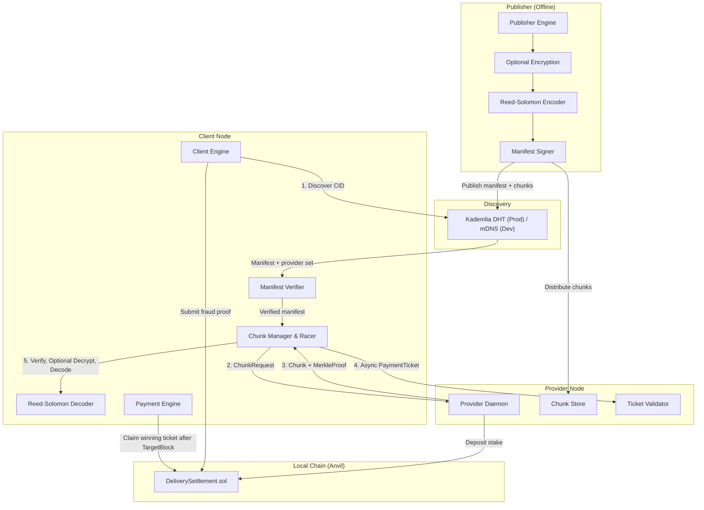
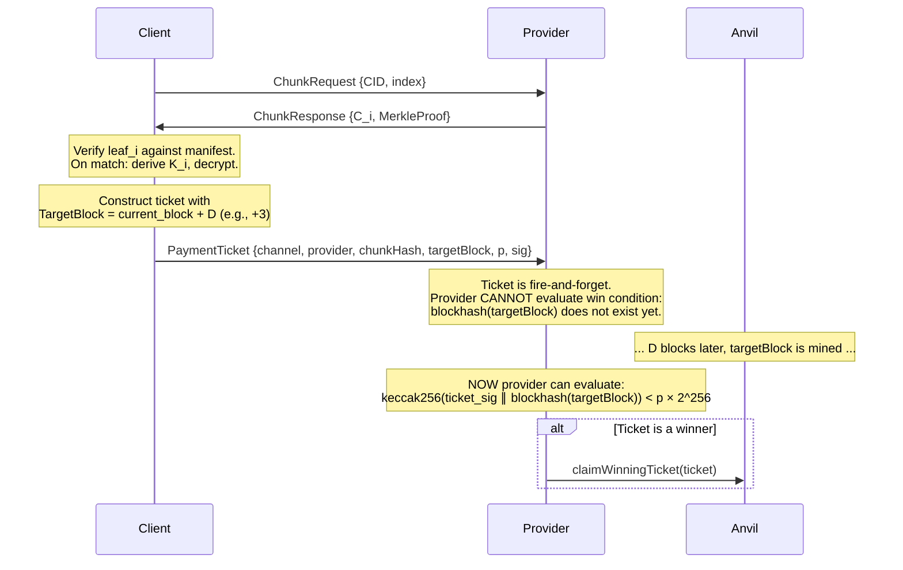
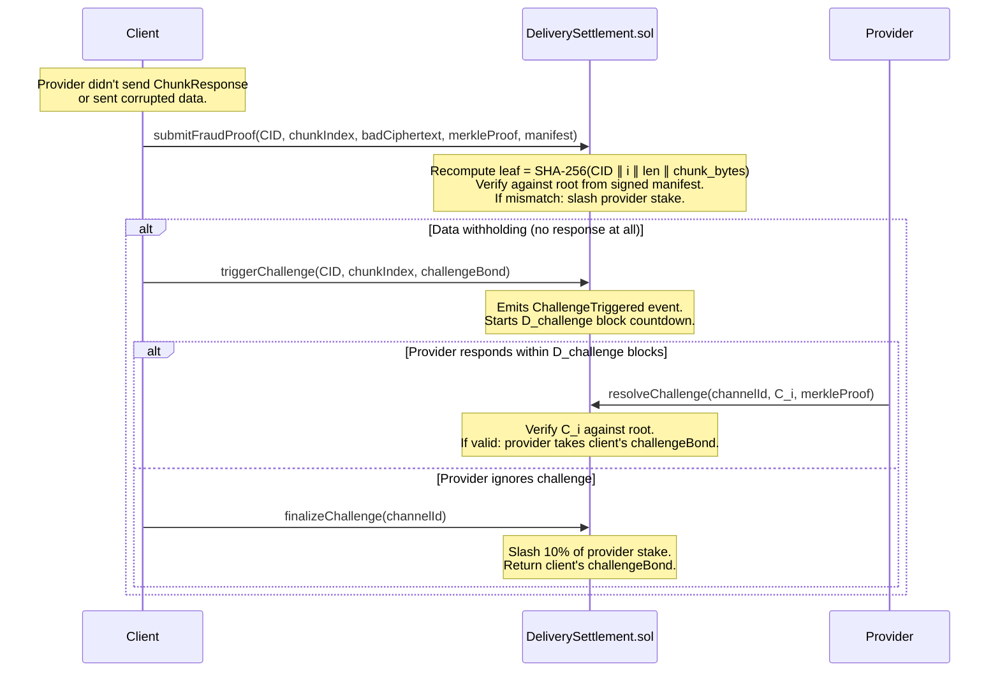
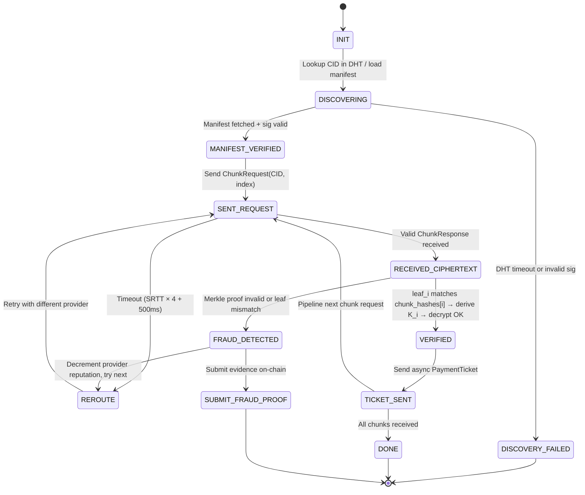
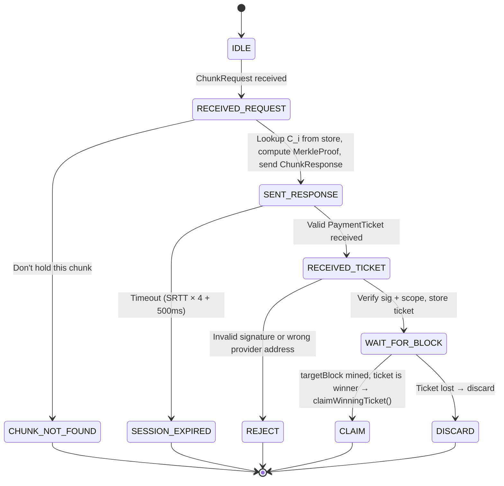

# CIPHER — Definitive Protocol Specification

> **Content-Integrity Proofs for Hosted, Ephemeral Relay**
> A Trust-Minimized, Peer-Provisioned CDN with Cryptographic Delivery Proofs
> Status: Implementation-Ready
> Zero-cost local development on Anvil. On-chain deployment deferred.

---

## 1. Executive Summary

CIPHER is a decentralized content delivery protocol where storage/bandwidth providers are paid per chunk for **verifiably correct delivery**, without a trusted intermediary, and without round-trip overhead that would cap streaming throughput.

The core innovation of this protocol is the **publisher-signed Merkle manifest**: the publisher hashes all content chunks offline into a Merkle tree and signs the root with ECDSA. Providers are dumb byte-servers. A client verifies each chunk against the signed Merkle root **immediately upon receipt** — no key exchange, no challenge-response, no second round trip.

**Encryption is opt-in.** The protocol does not rely on encryption for its delivery guarantees. Publishers who want content privacy or access control may encrypt chunks before building the Merkle tree (see section 10 — Opt-In Encryption). The core delivery proof works identically with plaintext chunks.

### 1.1 Issues Considered and Solved

Three structural problems in previous design iterations triggered this architecture:

**Objection A — Merkle proofs are unverifiable before payment.** If the provider encrypts per-request with a key the client doesn't have, the client cannot check a Merkle leaf until after key reveal — i.e., after the trust decision has already been made.

**Objection B — Round trips kill streaming.** A `KeyReveal` round trip after every ticket adds a full RTT per chunk. At 2 RTTs per chunk, sustained 4K streaming at 25 Mbps requires impossibly low latency or impractically large chunks.

**Objection C — Who holds ground truth?** The client needs to know what a chunk *should* hash to. In earlier designs, the Merkle root arrived "out-of-band" with no specification. In this protocol, the publisher signs it — single ECDSA signature, unforgeable, `O(1)` to verify.

### 1.2 The Fix

| Problem | Previous Approach | Resolved Approach |
|---|---|---|
| Merkle unverifiable pre-payment | Provider encrypts → client verifies post-`KeyReveal` | Publisher builds Merkle tree offline → client verifies immediately against signed manifest |
| 2 RTT per chunk | `ChunkRequest → ChunkResponse → Ticket → KeyReveal` | `ChunkRequest → ChunkResponse` + async ticket (1 RTT, fire-and-forget) |
| Ground truth unspecified | "Out-of-band" (T1, acknowledged) | Publisher ECDSA signature over `root ∥ CID` |
| Selective key withholding | Future-block entropy + on-chain challenge for key reveal | Provider never holds encryption keys — attack surface eliminated entirely |

### 1.3 What Was Removed

| Component | Reason |
|---|---|
| `KeyReveal` message (`MsgType 0x04`) | No per-request key negotiation — provider never holds encryption keys |
| `H_resp` commitment (`keccak256(K ∥ plaintext)`) | Replaced by Merkle-over-chunk verified against publisher-signed manifest |
| `ProviderCommitment` (`MsgType 0x00`) | No provider-side entropy commitment needed |
| `SENT_TICKET → RECEIVED_KEY` client state | No `KeyReveal` exists to transition into |
| Provider key generation (`crypto/rand` per chunk) | Provider never generates or holds encryption keys |
| Provider WAL for key persistence | No keys to persist — provider is stateless w.r.t. cryptographic material |

---

## 2. Architecture



| Layer | Purpose | Key Mechanism |
|---|---|---|
| **Preparation** | One-time content hashing, erasure coding, Merkle tree, signing | Reed-Solomon + SHA-256 Merkle tree + Publisher ECDSA. Opt-in: ChaCha20-Poly1305 encryption. |
| **Discovery** | Content ID → manifest + provider set resolution | Kademlia DHT (`O(log₂ N)` hops), mDNS for dev |
| **Settlement** | Stake, payments, fraud proofs, dispute resolution | `DeliverySettlement.sol` on Anvil |
| **Channel** | Probabilistic micropayments | Future-block entropy lottery tickets |
| **Transport** | Multiplexed streams, erasure coding, racing | QUIC via libp2p + klauspost/reedsolomon |
| **Delivery Proof** | Cryptographic binding of payment to correct delivery | Merkle-over-chunk verified against publisher-signed manifest |

---

## 3. Notation and Preliminaries

| Symbol | Meaning |
|---|---|
| `SK_pub` / `PK_pub` | Publisher's private / public signing key pair (ECDSA / secp256k1) |
| `master_key` | **[Opt-in encryption]** Symmetric master key from which per-chunk keys are derived (32 bytes) |
| `K_i` | **[Opt-in encryption]** Per-chunk symmetric key: `K_i = HKDF-SHA256(master_key, "cipher-chunk" ∥ uint64(i))` |
| `chunk_i` | Plaintext bytes of chunk `i` of the source content |
| `C_i` | Chunk bytes delivered by provider. Equals `chunk_i` (plaintext mode) or ChaCha20-Poly1305 ciphertext (encrypted mode). |
| `leaf_i` | Merkle leaf hash for chunk `i`, computed over the chunk bytes |
| `root` | Merkle root over all leaves; the content's single delivery commitment |
| `CID` | Content identifier: `CID = keccak256(root ∥ PK_pub)` |
| `RS(k, n)` | Reed-Solomon parameters: `n` total shares, any `k` reconstruct the content |
| `sig` | Publisher's signature over `root ∥ CID` |
| `p` | Win probability for probabilistic payment ticket |
| `D` | Block delay parameter for future-block entropy (default: 3) |

---

## 4. Core Design Decisions

### 4.1 Publisher-Signed Merkle Manifest — The Foundation

**Problem (Earlier Ideations)**: Provider encrypts each chunk per request with a fresh key `K`, then reveals the key only after receiving a payment ticket. This creates two fatal issues:
1. The client cannot verify a Merkle proof before payment — verification requires the key, which arrives *after* the trust decision.
2. The `KeyReveal` round trip adds a full RTT per chunk — unacceptable for streaming.

**Resolved Approach**: The publisher builds the Merkle tree offline over chunk data (plaintext by default) and signs the root. The provider is a dumb byte-server — it never encrypts, never holds keys, never reveals keys.

#### Merkle Leaf Construction (Default — Plaintext)

```
leaf_i = SHA-256(CID || uint64(i) || uint64(len(chunk_i)) || chunk_i)
```

This binds four dimensions:
- **CID**: Prevents cross-content chunk substitution (a chunk from Content A cannot satisfy Content B’s proof)
- **Chunk index**: Prevents index shuffling within the same content
- **Length**: Detects truncation or padding attacks
- **Chunk bytes**: The actual data commitment

The provider becomes a **dumb byte-server**: it stores publisher-produced chunks, computes Merkle proofs on request, and serves them.

#### Opt-In Encryption

Publishers who require content privacy or access control may encrypt chunks *before* building the Merkle tree. When encryption is enabled:

```
K_i    = HKDF-SHA256(master_key, "cipher-chunk" || big_endian(uint64(i)))
nonce_i = first_12_bytes(SHA-256("cipher-nonce" || uint64(i)))
C_i    = ChaCha20-Poly1305.Seal(K_i, nonce_i, chunk_i, aad=nil)
leaf_i = SHA-256(CID || uint64(i) || uint64(len(C_i)) || C_i)
```

The Merkle tree is then built over `C_i` (ciphertext) instead of `chunk_i`. The delivery proof mechanism is **identical** — the client simply verifies the leaf and, if it holds the decryption keys, additionally decrypts after verification. The protocol itself has no opinion on whether chunks are encrypted.

**Why deterministic encryption when used**: Each chunk uses a unique key `K_i` derived via HKDF, so a fixed nonce is safe (no `(key, nonce)` pair is ever reused). The publisher always produces identical ciphertext for the same content, enabling a deterministic Merkle root.

**The key distribution problem**: If encryption is enabled, `master_key` must reach authorized clients. This is out-of-band from the core delivery protocol — see §10.

---

### 4.2 Dual-Hash Strategy — SHA-256 (Content) + keccak256 (Chain)

| Context | Hash | Rationale |
|---|---|---|
| Merkle tree leaves & root (`root`) | SHA-256 | Publisher computes offline. Clients verify locally. Hardware-accelerated. Cross-platform. Not EVM-bound. |
| On-chain fraud proof recomputation | SHA-256 (precompile `0x02`) | Rare path. ~60 gas + data. Acceptable for disputes. |
| Merkle tree internal nodes | SHA-256 | Consistent with leaves. |
| Ticket nullifier hash | keccak256 | On-chain storage key. Native EVM opcode (30 gas). |
| Win condition entropy | keccak256 | On-chain computation with `blockhash`. |
| Channel/provider identity | keccak256 | EVM-native addressing. |

**Why not keccak256 everywhere?** SHA-256 has hardware acceleration on virtually all modern CPUs (x86 SHA Extensions, ARM SHA-2), making content-layer operations faster. Keccak256 is reserved for the EVM where it's a native opcode. The two never need to interoperate — SHA-256 handles content integrity, keccak256 handles on-chain logic.

---

### 4.4 Future-Block Entropy Lottery — Defeating Selective Behavior

The provider no longer holds a key to withhold selectively, but it could still selectively withhold *data*. Future-block entropy defeats this.



**The ticket is fire-and-forget.** It does not block the next chunk request. The client sends it asynchronously after verifying the chunk, and immediately pipelines the next `ChunkRequest` — possibly to a different provider.

**The `D` parameter** (block delay):
- Anvil (1s blocks): `D = 3` → 3s of uncertainty
- Real L2 (0.25s blocks): `D = 12` → 3s of uncertainty
- Constraint: provider must respond before `targetBlock` is mined, so the client already has its data before the outcome is known

**EVM constraint — 256 block lookback**: `blockhash(n)` only works for the most recent 256 blocks. Provider must claim within 256 blocks of `targetBlock`:
- Anvil (1s blocks): 256 seconds
- Arbitrum (0.25s blocks): 64 seconds

**Win condition** (on-chain):
```solidity
function isWinner(Ticket memory t) internal view returns (bool) {
    require(block.number > t.targetBlock, "Block not mined");
    require(block.number <= t.targetBlock + 256, "Blockhash expired");
    
    bytes32 entropy = keccak256(abi.encodePacked(t.signature, blockhash(t.targetBlock)));
    return uint256(entropy) < t.p;
}
```

---

### 4.5 On-Chain Dispute Resolution

In this protocol, the challenge path handles **data withholding** and **data corruption** — not key withholding (providers no longer hold keys).



**Slash compounding**: 10% → 19% → 27.1% → ... Enough to deter systematic withholding, not so severe that a single network hiccup bankrupts an honest provider.

---

### 4.6 Ticket Nullifier Map — Replay Prevention

```solidity
mapping(bytes32 => bool) public spentTickets;

function claimWinningTicket(Ticket memory t) external {
    bytes32 ticketHash = keccak256(abi.encode(t));
    require(!spentTickets[ticketHash], "Ticket already spent");
    spentTickets[ticketHash] = true;
    // ... verify and pay
}
```

**Advantages over monotonic nonces**: Order-independent redemption, no session boundaries, simpler contract logic. Same gas cost (~20K SSTORE on first write).

---

### 4.7 CID-Bound Merkle Leaves — Cross-Content Shuffle Prevention

$$\text{leaf}_i = \text{SHA-256}(\text{CID} \| \text{uint64}(i) \| \text{uint64}(\text{len}(C_i)) \| C_i)$$

A chunk from Content A cannot satisfy Content B’s Merkle proof. The CID is derived from the content itself: `CID = keccak256(root ∥ PK_pub)` (where `root` is computed over plaintext chunks in default mode, or ciphertext in encrypted mode).

---

### 4.8 Double Spending in Parallel Connections

**Over-Collateralized Shared Escrow** — the client locks a single deposit and issues probabilistic tickets across multiple parallel provider connections:

- Contract enforces: `client deposit ≥ M × FaceValue` where `M` bounds the variance
- Probabilistic tickets + future-block entropy make simultaneous winning across many connections astronomically unlikely
- At `p = 10⁻²` and `FaceValue = $1`, a $50 deposit supports 50 parallel connections safely
- No off-chain coordination between providers needed — pure statistics

---

## 5. Protocol Phases

### Phase 1 — Content Preparation (Publisher, Offline)

The publisher is the **only** party that ever encrypts. This phase runs once per content item:

1. **Split** source content into chunks of 32 KB (the last chunk may be smaller)
2. **Erasure-code**: Apply Reed-Solomon `(k, n)` to produce `n` shards from `k` data chunks
3. **[Optional] Encrypt each shard** (if publisher wants content privacy):
   - `K_i = HKDF-SHA256(master_key, "cipher-chunk" || uint64(i))`
   - `nonce_i = first_12_bytes(SHA-256("cipher-nonce" || uint64(i)))`
   - `C_i = ChaCha20-Poly1305.Seal(K_i, nonce_i, shard_i, aad=nil)`
   - If not encrypting: `C_i = shard_i` (plaintext)
4. **Compute Merkle tree**:
   - `leaf_i = SHA-256(CID || uint64(i) || uint64(len(C_i)) || C_i)`
   - `root = MerkleRoot(leaf_0 ... leaf_{n-1})` (binary tree, SHA-256 internal nodes)
5. **Derive CID**: `CID = keccak256(root ∥ PK_pub)`
6. **Sign**: `sig = ECDSA.Sign(SK_pub, keccak256(root ∥ CID))`
7. **Build manifest**:
   ```json
   {
     "version": 2,
     "cid": "0x...",
     "root": "0x...",
     "publisher_pubkey": "0x...",
     "signature": "0x...",
     "rs_k": 10,
     "rs_n": 15,
     "chunk_count": 15,
     "chunk_size": 32768,
     "chunk_hashes": ["0x...", "0x...", ...],
     "encrypted": false,
     "encrypted_master_key": "0x..."  // omitted if not encrypting
   }
   ```
8. **Distribute**: Push shards to providers. Push manifest to DHT / local directory.

> **Note**: Step 5 creates a circular dependency (CID depends on `root`, but `leaf_i` depends on CID). Resolution: compute `root` first without CID in the leaves, derive CID, then recompute the tree with CID included. This is a two-pass computation done once, offline.

### Phase 2 — Discovery (One-Time per Session)

Client resolves `CID` → manifest + provider set:

1. **Kademlia DHT lookup**: `O(log₂ N)` hops for network of `N` nodes
2. Fetch manifest from nearest DHT nodes
3. **Verify** `sig` against `PK_pub` from the manifest
4. Cache manifest locally (subsequent lookups are free)
5. Build provider candidate list from DHT provider records
6. **[Optional, encrypted content only]** Decrypt `master_key` from `encrypted_master_key` using client's private key (ECIES)

**Dev mode**: mDNS on localhost, manifest loaded from local file system.

| Network Size | DHT Hops | Estimated Latency |
|---|---|---|
| 1,000 nodes | ~10 | 300–600 ms |
| 10,000 nodes | ~13 | 400–800 ms |
| 1,000,000 nodes | ~20 | 600 ms – 1.5 s |

### Phase 3 — Streaming (Per-Chunk, Steady State)

This is the hot loop. **1 RTT per chunk, payment is async**:

1. Client sends `ChunkRequest {CID, chunkIndex}` to provider
2. Provider responds with `ChunkResponse {C_i, MerkleProof}`
3. Client recomputes `leaf_i = SHA-256(CID || i || len(C_i) || C_i)` and checks against `chunk_hashes[i]` from the manifest
4. **On match**: Send async `PaymentTicket`, immediately pipeline next `ChunkRequest`. If content is encrypted, additionally derive `K_i = HKDF(master_key, i)` and decrypt.
5. **On mismatch**: No ticket issued, provider reputation decremented, chunk re-requested from next provider. No chain interaction needed.

---

## 6. Availability: Reed-Solomon Coding

Reed-Solomon `(k, n)` coding is computed once by the publisher (Phase 1) and decoded locally by the client. Redundancy is a content-layer property, not a network-layer one.

| RS Parameters `(k, n)` | Provider Failure Tolerance | Storage Overhead |
|---|---|---|
| (6, 9) | 33% | 1.5× |
| (10, 15) | 33% | 1.5× |
| (6, 10) | 40% | 1.67× |
| (4, 8) | 50% | 2× |

**Recommended default**: `(10, 15)` — 33% of providers may fail mid-session, playback continues, at 1.5× storage overhead.

**Why BFT-majority was dropped**: The publisher is a trusted, identifiable signer. A single ECDSA signature is unforgeable under ECDLP, is `O(1)` to verify, and is strictly stronger than any `f`-of-`n` BFT scheme (which remains vulnerable if attacker controls > `f` providers). BFT solves agreement among untrusted parties; we have a trusted publisher, so BFT is unnecessary complexity.

**Parallel fetch**: The client fires `n` parallel requests to `n` different providers for a `(k, n)` group. It accepts the first `k` verified responses and cancels the rest. Total fetch time per group ≈ `max(RTT)` across the `k`-fastest providers, not the sum.

---

## 7. Complete Protocol Flow

The protocol is a **3-message exchange** per chunk:

| Phase | Message | Direction | Purpose |
|---|---|---|---|
| 1 — Request | `ChunkRequest` | Client → Provider | Request chunk by CID + index |
| 2 — Deliver + Prove | `ChunkResponse` | Provider → Client | Chunk bytes + Merkle inclusion proof |
| 3 — Pay (async) | `PaymentTicket` | Client → Provider | Provider-scoped, future-block-bound ticket (fire-and-forget) |

**Post-protocol (asynchronous)**:
- Provider evaluates win condition after `targetBlock` is mined
- If winner: provider calls `claimWinningTicket()` on Anvil
- If fraud detected: client calls `submitFraudProof()` on Anvil
- If data withheld: client calls `triggerChallenge()` on Anvil

**Performance characteristics**:

| Messages/Chunk | RTTs | Blocking? |
|---|---|---|
| **2 + async ticket** | **1** | **No — ticket is fire-and-forget** |

---

## 8. Protocol State Machines

### 8.1 Client State Machine



### 8.2 Provider State Machine



### 8.3 Edge Case Resolution

| Edge Case | Resolution | Max Cost |
|---|---|---|
| Ticket never arrives | Provider's session expires. Data was already sent (ciphertext only, no key leaked). Provider served bytes for free once. | ~1ms CPU |
| Provider sends wrong data | Client detects locally via Merkle verification. No ticket issued. Reroute to next provider. Optional: submit fraud proof on-chain. | 0 (local detection) |
| Provider never responds | Client timeout fires. Reroute to next provider. RS coding tolerates `(n-k)/n` failures. | 1 extra RTT |
| Client disconnects mid-protocol | Provider sent ciphertext (public data, no key leaked). No ticket = no payment obligation. Stateless. | None |
| Client submits false fraud proof | Contract recomputes SHA-256 leaf, verifies against `root`. Rejected. Client's bond slashed. | Client: bond |
| Double-spend across parallel providers | Over-collateralized escrow + probabilistic tickets. Simultaneous wins astronomically unlikely. | Bounded by `M × FaceValue` |
| Provider stalls response (selective withholding) | Client cannot know win condition yet (future-block entropy). Provider has no rational reason to stall. Timeout + reroute if it does. | 1 extra RTT |
| Manifest tampering | Client verifies `sig` against `PK_pub`. Invalid signature → reject entire manifest. | 0 (local ECDSA verify) |

---

## 9. Wire Format

### 9.1 Rules
- **Byte order**: Big-Endian (network byte order)
- **Version prefix**: First byte of every message = `0x02`
- **Variable fields**: Prefixed with `uint32` length
- **No padding**: Fields are packed

### 9.2 Messages (3 types)

| MsgType | Name | Direction |
|---|---|---|
| `0x01` | ChunkRequest | Client → Provider |
| `0x02` | ChunkResponse | Provider → Client |
| `0x03` | PaymentTicket | Client → Provider |

**ChunkRequest** (`0x01`):
```
[Version 1B][Type 1B][CID 32B][ChunkIndex 8B]
Total: 42 bytes (fixed)
```

**ChunkResponse** (`0x02`):
```
[Version 1B][Type 1B][CID 32B][ChunkIndex 8B]
[CiphertextLen 4B][Ciphertext VarB]
[ProofDepth 4B][MerkleHashes ProofDepth×32B]
```
Typical size for 32 KB chunk with depth-9 proof: 2 + 32 + 8 + 4 + 32768 + 4 + 288 = ~33,106 bytes.

**PaymentTicket** (`0x03`):
```
[Version 1B][Type 1B][ChannelID 32B][ProviderAddr 20B]
[ChunkHash 32B][TargetBlock 8B][WinProb 4B][SigLen 4B][Signature VarB]
```
Typical size with 65-byte ECDSA signature: 2 + 32 + 20 + 32 + 8 + 4 + 4 + 65 = 167 bytes.

**Removed**: `KeyReveal` message — no longer exists.

---

## 10. Opt-In Encryption

Encryption is **not required** by the CIPHER protocol. The delivery proof (Merkle-over-chunk vs. signed manifest) works identically for plaintext and ciphertext chunks. Publishers who need content privacy or access control may opt into encryption as described below.

### 10.1 `master_key` Delivery

When encryption is enabled, the client obtains `master_key` through the manifest itself:

1. Publisher generates `master_key` (32 bytes, `crypto/rand`)
2. For each authorized client with public key `PK_client`:
   - `encrypted_master_key = ECIES.Encrypt(PK_client, master_key)`
3. The encrypted key is embedded in the manifest's `encrypted_master_key` field
4. Client decrypts with its private key during Phase 2 (Discovery, step 6)

**Zero extra round trips** — the manifest is already fetched during discovery.

**Important separation**: Compromise of `master_key` breaks **confidentiality** but not **delivery integrity** — `root` remains independently verifiable regardless. CIPHER proves correct delivery, not content secrecy.

### 10.2 Publisher Signature — Forgery Resistance

ECDSA over secp256k1 is unforgeable under the elliptic curve discrete logarithm assumption. An attacker cannot produce a valid `sig` for a tampered manifest without `SK_pub` — the same security assumption underlying every Ethereum transaction.

---

## 11. Game-Theoretic Analysis

### 11.1 Provider's Options

| Action | Outcome |
|---|---|
| Serve correct `C_i` with valid Merkle proof | Client pays (async ticket). Expected revenue = `p × FaceValue` per chunk. |
| Serve wrong bytes with fabricated proof | Merkle verification fails locally. No ticket. Zero revenue. Reputation decremented. |
| Serve correct `C_i` with wrong proof | Same — proof verification fails. No ticket. |
| Accept request, never respond | Client times out, reroutes. Provider earns zero, loses reputation. |

The provider **cannot** construct a valid Merkle proof for bytes it doesn’t possess, and `root` originates from the publisher. Any deviation produces a locally detectable failure at zero cost to the client.

### 11.2 Client's Options

| Action | Outcome |
|---|---|
| Pay honestly after valid proof | Receives correct data; normal operation. |
| Submit false fraud claim | On-chain contract recomputes leaf, verifies against `root`. Rejected. Client's bond slashed. Net loss. |
| Never send ticket after valid data | Provider served bytes for free once. Bounded by escrow and reputation. |

### 11.3 Probabilistic Micropayments (Dual-Nonce Lottery)

Probabilistic ticket with win probability `p`. Face value on win = `FaceValue / p`. Revenue variance after `N` chunks: `σ/μ = 1/√(N × p)`.

| Win probability `p` | Chunks for ±10% convergence |
|---|---|
| 10⁻² | N ≥ 100 |
| 10⁻³ | N ≥ 10,000 |
| 10⁻⁴ | N ≥ 1,000,000 |

**Recommended**: `p = 10⁻²` for session-level payments. At 32 KB chunks, 10,000 chunks = ~320 MB before payment error exceeds 10%.

### 11.4 Fraud Proofs Are Symmetrically Verifiable

The on-chain contract recomputes the Merkle leaf from submitted chunk bytes and checks against `root`. No privileged information needed. No ambiguity. No trusted arbiter. Both parties can independently verify the outcome.

---

## 12. Settlement Contract Design

### 12.1 Contract: `DeliverySettlement.sol`

Runs on Anvil (dev). Chain-agnostic Solidity 0.8.x for future L2 deployment.

**State:**
```solidity
mapping(address => uint256) public providerStake;
mapping(bytes32 => bool)    public spentTickets;      // Nullifier map
mapping(bytes32 => Challenge) public activeChallenges; // Data withholding disputes
mapping(bytes32 => bytes32)  public contentRoots;      // CID => root (optional on-chain anchor)

struct Challenge {
    address client;
    uint256 bondAmount;
    uint256 deadline;      // Block number
    bytes32 contentCID;
    uint64  chunkIndex;
}
```

**Functions:**

| Function | Purpose | Gas (est.) |
|---|---|---|
| `registerProvider()` | Stake ETH. Enforces `stake > FaceValue` | ~50K |
| `openChannel(provider)` | Lock deposit, allocate budget, enforce over-collateralization | ~80K |
| `claimWinningTicket(ticket)` | Verify sig + nullifier + future-block win condition + transfer | ~120K |
| `submitFraudProof(evidence)` | Recompute SHA-256 leaf (precompile `0x02`) + verify against `root` + slash or reject | ~600K (32KB calldata) |
| `triggerChallenge(CID, chunkIndex)` | Post challenge bond, start countdown (data withholding) | ~100K |
| `resolveChallenge(channelId, C_i, proof)` | Provider submits ciphertext + proof on-chain, takes client bond | ~90K |
| `finalizeChallenge(channelId)` | Slash provider 10% after deadline | ~60K |
| `closeChannel(channelId)` | 24h cooldown, then release deposit | ~60K |

### 12.2 Fraud Proof Verification (on-chain)

```
1. Fetch:     root from signed manifest (or on-chain anchor)
2. Recompute: leaf = SHA-256(CID ∥ chunkIndex ∥ len(chunk_bytes) ∥ chunk_bytes)  // via precompile 0x02
3. Verify:    MerkleVerify(root, leaf, proof)
4. If FALSE:  Chunk doesn't match manifest → slash provider stake
5. If TRUE:   Chunk is valid → client submitted false proof → slash client bond
```

---

## 13. Protocol Metrics (Estimated)

### 13.1 Per-Chunk Delivery

| Scenario | Single RTT | k=10 parallel group |
|---|---|---|
| Same datacenter | ~1 ms | ~2 ms |
| Same continent | ~30–50 ms | ~40–70 ms |
| Cross-continent | ~100–180 ms | ~120–200 ms |

### 13.2 Throughput Ceiling

With chunk size `S` and RTT `R`, per-provider throughput ≈ `S / R`. With `k` providers in parallel:

| Chunk Size | RTT 50ms, single provider | k=10 aggregate |
|---|---|---|
| 32 KB (default) | ~5 Mbps | ~50 Mbps |
| 64 KB | ~10 Mbps | ~100 Mbps |
| 256 KB | ~40 Mbps | ~400 Mbps |
| 1 MB | ~160 Mbps | ~1.6 Gbps |

For 4K streaming at ~25 Mbps, a single nearby provider at 64 KB chunks is sufficient. With k=10 parallel at 32 KB default, aggregate ~50 Mbps handles 4K easily. Reed-Solomon parallelism is primarily a **redundancy** benefit, not a throughput requirement.

### 13.3 Cold Start to First Frame

| Stage | Estimated Time |
|---|---|
| DHT lookup (one-time, then cached) | ~500 ms |
| Manifest signature verify (local ECDSA) | ~1 ms |
| [Opt-in] Master key decrypt (local ECIES) | ~1 ms |
| Parallel chunk fetch (1 RTT, nearby providers) | ~50 ms |
| RS decode + [opt-in] decrypt (local CPU) | ~10 ms |
| **Cold start total** | **~560 ms** |
| **Warm start total** (cached manifest) | **~60 ms** |

Both under the ~1 second perceptual threshold for video start latency.

### 13.4 Data Integrity

- **Detection probability**: Any tampered chunk changes the SHA-256 leaf. Undetected corruption probability: `2⁻²⁵⁶ ≈ 10⁻⁷⁷` — effectively zero.
- **Publisher signature forgery**: Unforgeable under ECDLP (same assumption as Ethereum).
- **Comparison**: Categorically stronger than a standard `H_resp` challenge-response, which is only as strong as the provider's willingness to commit honestly.

---

## 14. Assumption Registry

### 14.1 Cryptographic

| # | Assumption | Status | Resolution |
|---|---|---|---|
| C1 | keccak256 collision resistance | **Acknowledged** | Standard. Same assumption as Ethereum. Version prefix enables future hash migration. |
| C2 | SHA-256 collision resistance | **Acknowledged** | Standard. Used for content Merkle tree. Hardware-accelerated on modern CPUs. |
| C3 | EUF-CMA of secp256k1 | **Acknowledged** | Inherited from Ethereum. If broken, all of DeFi breaks first. |
| C4 | Nonce unpredictability (tickets) | **Addressed** | `crypto/rand` mandated. `math/rand` is a critical violation. |
| C5 | ChaCha20-Poly1305 IND-CPA | **[Opt-in]** | Applies only when encryption is enabled. Standard cipher: TLS 1.3, WireGuard, Signal. |
| C6 | HKDF determinism + domain separation | **[Opt-in]** | Applies only when encryption is enabled. Per-chunk keys via `HKDF(master_key, "cipher-chunk" ∥ i)`. |
| C7 | Lottery fairness (no grinding) | **Addressed** | Future-block entropy. Neither party knows `blockhash(targetBlock)` at ticket time. |
| C8 | Deterministic nonce safety | **[Opt-in]** | Applies only when encryption is enabled. Each chunk uses a unique key `K_i`; no `(key, nonce)` reuse. |

### 14.2 Network & Timing

| # | Assumption | Status | Resolution |
|---|---|---|---|
| N1 | Bounded network delay | **Addressed** | Adaptive EWMA RTT timeouts (TCP-style). Cold start: 10s. Steady state: SRTT×4+500ms. |
| N2 | No total partition | **Bounded** | Erasure coding tolerates `(n−k)/n` failure. k=10, n=15 → 33%. |
| N3 | Reliable message delivery | **Acknowledged** | libp2p QUIC → TCP fallback. Transport-agnostic. |
| N4 | Ticket reaches chain in time | **Bounded** | 256-block redemption window. On Anvil: 256s. On Arbitrum: 64s. |
| N5 | 24h cooldown sufficient | **Bounded** | Configurable constructor argument. |
| N6 | Kademlia DHT availability | **Acknowledged** | Standard DHT assumptions. Eclipse attacks bounded by k-bucket structure. |

### 14.3 Economic & Game-Theoretic

| # | Assumption | Status | Resolution |
|---|---|---|---|
| E1 | Rational adversaries | **Acknowledged** | Deters profitable attacks. Same model as Bitcoin PoW. |
| E2 | Provider variance risk | **Bounded** | Monte Carlo determines min `N` for ±5% revenue convergence. |
| E3 | Face value calibration | **Bounded** | Simulation sweeps parameter space. Prototype uses synthetic costs. |
| E4 | Client bond deters false fraud | **Addressed** | `ClientBond ≥ FaceValue`. Expected gain from lying = 0. |
| E5 | No collusion | **Bounded** | Provider-scoped tickets prevent cross-channel draining. |
| E6 | Sybil via staking | **Acknowledged** | Free on Anvil. On real chain: `Stake > FaceValue` makes Sybil unprofitable. |
| E7 | Selective data withholding | **Addressed** | Future-block entropy (provider blind to outcome) + on-chain challenge fallback. |

### 14.4 Trust

| # | Assumption | Status | Resolution |
|---|---|---|---|
| T1 | Merkle root integrity | **Addressed** | Publisher signs `root ∥ CID`. Single ECDSA signature — unforgeable source of truth. |
| T2 | Content authenticity | **Acknowledged** | CIPHER proves delivery integrity, not content intent. |
| T3 | Provider storage at rest | **Acknowledged** | Rerouting via k-of-n. Continuous PoS is a different problem. |
| T4 | ≥1 honest provider per shard | **Bounded** | Tolerable failure = `(n−k)/n`. |
| T5 | Publisher is identifiable and trusted | **Acknowledged** | Single trust anchor. The protocol assumes a known publisher. |
| T6 | `master_key` distribution | **[Opt-in]** | Applies only when encryption is enabled. ECIES-wrapped in manifest. Zero extra round trips. See §10.1. |

### 14.5 Implementation

| # | Assumption | Status | Resolution |
|---|---|---|---|
| I1 | Single language (Go) | **Bounded** | Wire format spec (§9) enables cross-language clients. |
| I2 | Local-only discovery (dev) | **Acknowledged** | mDNS → Kademlia DHT is one config change. |
| I3 | Anvil block time artificial | **Acknowledged** | All time-dependent parameters are constructor arguments. |
| I4 | No storage redundancy per node | **Acknowledged** | Network redundancy (k-of-n), not node redundancy. |
| I5 | Go GC pauses | **Bounded** | GC ~1-10ms ≪ 500ms safety margin. |

### 14.6 Protocol Design

| # | Assumption | Status | Resolution |
|---|---|---|---|
| P1 | Ticket replay | **Addressed** | Nullifier map. Order-independent. |
| P2 | No forward secrecy | **Acknowledged** | Key compromise leaks payment history, not funds. |
| P3 | Variable chunk sizes | **Addressed** | Leaf = `SHA-256(CID ∥ index ∥ length ∥ chunk_bytes)`. Truncation detectable. |
| P4 | Fraud proof window sizing | **Bounded** | Constructor parameter. Tunable per chain. |
| P5 | Access pattern leakage | **Acknowledged** | Privacy concern, not security. Future: decoy requests. |
| P6 | Cross-content chunk shuffle | **Addressed** | CID bound into Merkle leaf. |
| P7 | CID circular dependency | **Addressed** | Two-pass Merkle computation during Phase 1 (§5, Note). |

---

## 15. Local Testbed (Zero Cost)

```
┌─────────────────────────────────────────────┐
│              Developer Machine              │
│                                             │
│  ┌─────────┐  Anvil (Port 8545)             │
│  │  EVM    │  - Infinite ETH                │
│  │  Local  │  - 1s blocks (configurable)    │
│  │  Chain  │  - Deterministic               │
│  └────┬────┘                                │
│       │ JSON-RPC                            │
│  ┌────┼─────────────────────────────┐       │
│  │    │  cipher-node processes      │       │
│  │  Publisher     (port 9200)       │       │
│  │  Provider0..4 (ports 9000-9004)  │       │
│  │  Client       (port 9100)        │       │
│  └──────────────────────────────────┘       │
│                                             │
│  Discovery: mDNS (auto on localhost)        │
│  Total cost: $0                             │
└─────────────────────────────────────────────┘
```

**Publisher** is a new process in the testbed. It runs Phase 1 content preparation (erasure coding, Merkle tree, signing; optional encryption) and distributes shards to provider directories.

**Toolchain**: Go + Foundry (forge/anvil) + Python (Monte Carlo). All free, all local.

---

## 16. Out of Scope (Deferred)

| Feature | Why Deferred | Path Forward |
|---|---|---|
| On-chain deployment | Zero-cost goal. Anvil validates correctness. | Contracts are chain-agnostic Solidity. Deploy to any EVM L2. |
| DRM / private content | Orthogonal to delivery proof. | Double-encryption + KMS layer above CIPHER. |
| Forward secrecy | Privacy enhancement, not security. | Ephemeral DH session keys. |
| Access pattern privacy | Privacy, not integrity. | Decoy chunks, onion routing, index permutation. |
| Continuous Proof of Storage | Different problem (storage ≠ delivery). | Filecoin PoSt or custom PoR. |
| Provider staking pools | Needs simulation data first. | Pool contract aggregating variance. |
| Multi-machine deployment | Prototype validates protocol, not ops. | mDNS → DHT (one config flag). |
| Cross-language clients | Go-only for now. Wire format is specified. | Implement parser in Rust/JS/Python. |
| Chunk announcement granularity | Needs churn measurement data. | Default whole-file, fallback chunk-level. |
| DHT refresh interval tuning | Needs empirical data. | Start with 1h (IPFS convention). |

---

## Appendix A: Architectural Evolution (Issues Considered and Solved)

| Iteration Model | Messages/Chunk | RTT/Chunk | Key Holder | Ground Truth | Fatal Flaw |
|---|---|---|---|---|---|
| **Early Design 1** | 6 | 3 | Provider | BFT majority (proposed) | Unverifiable proofs pre-payment + 3 RTT |
| **Early Design 2** | 4 | 2 | Provider | "Out-of-band" (acknowledged) | Selective reveal attack + 2 RTT |
| **Final Protocol** | 2 + async ticket | 1 | Publisher (offline, opt-in) | Publisher ECDSA signature | None known (see §14) |
